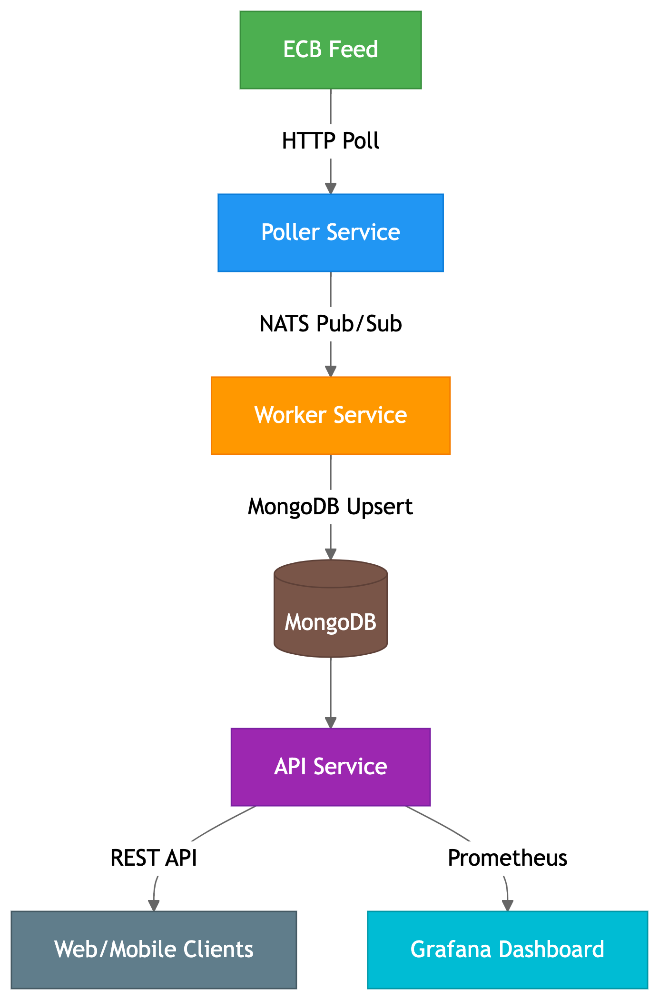

# 📰 SportStream – Sports News Microservice Platform



## 📌 Overview

A microservice-based backend system built in Go that ingests, processes, stores, and exposes sports news articles from external sources. Containerized with Docker and orchestrated via Docker Compose.

## 🚀 Features

- **Core Services**

  - 🕒 Periodic ECB feed polling
  - 🔁 NATS message queuing
  - 📦 MongoDB persistence
  - 🔎 REST API with Swagger docs

- **Observability**

  - 📈 Prometheus metrics collection
  - 📊 Grafana dashboarding
  - 🔄 Health checks

- **DevOps**
  - 🐳 Docker containers
  - ⚙️ Makefile automation
  - 🔄 CI/CD ready

## 🏗️ System Architecture

### Project structure

sportstream/
├── api/ # REST API service
├── poller/ # Feed ingestion
├── worker/ # Message processor
├── docker-compose.yaml
├── Makefile
└── docs/
└── swagger # API documentation

## 🕓 Scheduled Article Polling Job

The `poller` service uses [go-co-op/gocron](https://github.com/go-co-op/gocron) to schedule recurring article fetches from the ECB content service.

### ⏰ Cron Job Behavior

- Configurable via `infra.env`
- Fetches 2 articles per page
- Pages through all available data, then wraps around
- Automatically retries failed HTTP requests
- Publishes to NATS on:
  - `SPORTSTREAM.status.updated` (cleaned JSON)
  - `SPORTSTREAM.DOCKER.status.updated` (raw response)

### ⚙️ Sample Environment Configuration

```env
JOB.EXTERNAL_ADDRS=https://api.ecb.europa.eu/articles
JOB.RETRY.MAX_ATTEMPTS=3
JOB.RETRY.DURATION=2s
```

---

## 🐳 Docker Deployment

### Services Summary

| Service         | Port  | Purpose              | Depends On    |
| --------------- | ----- | -------------------- | ------------- |
| `poller`        | 80    | Fetch ECB feed       | NATS          |
| `worker`        | 3001  | Process articles     | NATS, MongoDB |
| `api`           | 8080  | Serve REST API       | MongoDB       |
| `nats`          | 4222  | Message broker       | -             |
| `mongodb`       | 27017 | Article storage      | -             |
| `mongo-express` | 8081  | DB administration UI | MongoDB       |
| `prometheus`    | 9090  | Metrics collection   | -             |
| `grafana`       | 3000  | Monitoring dashboard | Prometheus    |

### Quick Commands

```bash
# Start all services
make up

# Stop and clean
make down

# View logs
docker logs poller-service -f --tail=50
```

## Key Components:

- Poller Service: Scheduled ECB feed ingestion
- Worker Service: Async article processing
- API Service: REST interface with Swagger docs
- Observability: Real-time metrics dashboard

## Access Points

- API Docs: http://localhost:8080/swagger
- Grafana: http://localhost:3000 Default credentials: admin/admin
- Mongo-Express: http://localhost:8081
- NATS Monitoring: http://localhost:8222

## Testing

```bash
# Run unit tests
make api-test-unit

# Test NATS connectivity
docker exec -it sportstream-nats-box sh
nats sub "sportstream.articles"
```

✅ Completed

- ECB Feed Integration
- Periodic Polling
- Deduplicated MongoDB Storage
- NATS Messaging
- REST API + Swagger
- Docker Compose Support
- Prometheus + Grafana
- Test Coverage

👨💻 Maintainer
Ronny P.
GitHub: @ronnyp07

